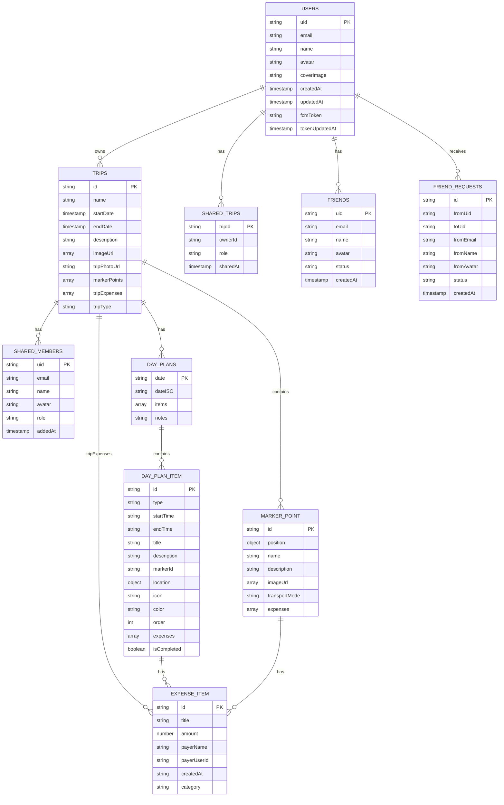

# Database Schema - Trip Planner

## Firestore Structure Overview



## Hierarchical Collection Structure

```
firestore/
│
└── users/ (collection)
    │
    └── {uid}/ (document)
        │
        ├── Fields:
        │   ├── email: string
        │   ├── name: string?
        │   ├── avatar: string?
        │   ├── coverImage: string?
        │   ├── createdAt: timestamp
        │   ├── updatedAt: timestamp
        │   ├── fcmToken: string?
        │   └── tokenUpdatedAt: timestamp?
        │
        ├── trips/ (subcollection)
        │   │
        │   └── {tripId}/ (document)
        │       │
        │       ├── Fields:
        │       │   ├── id: string
        │       │   ├── name: string
        │       │   ├── startDate: timestamp
        │       │   ├── endDate: timestamp?
        │       │   ├── description: string?
        │       │   ├── imageUrl: string[]
        │       │   ├── tripPhotoUrl: string?
        │       │   ├── markerPoints: MarkerPoint[]
        │       │   ├── tripExpenses: ExpenseItem[]
        │       │   └── tripType: "planned" | "ongoing"
        │       │
        │       ├── shared_members/ (subcollection)
        │       │   └── {memberId}/
        │       │       ├── uid: string
        │       │       ├── email: string
        │       │       ├── name: string?
        │       │       ├── avatar: string?
        │       │       ├── role: "owner" | "editor" | "viewer"
        │       │       └── addedAt: timestamp
        │       │
        │       └── dayPlans/ (subcollection)
        │           └── {YYYY-MM-DD}/
        │               ├── date: string (ISO8601)
        │               ├── items: DayPlanItem[]
        │               └── notes: string?
        │
        ├── shared_trips/ (subcollection)
        │   └── {tripId}/
        │       ├── tripId: string
        │       ├── ownerId: string
        │       ├── role: "owner" | "editor" | "viewer"
        │       └── sharedAt: timestamp
        │
        ├── friends/ (subcollection)
        │   └── {friendUid}/
        │       ├── uid: string
        │       ├── email: string
        │       ├── name: string?
        │       ├── avatar: string?
        │       ├── status: "pending" | "accepted" | "rejected" | "blocked"
        │       └── createdAt: timestamp
        │
        └── friend_requests/ (subcollection)
            └── {requestId}/
                ├── fromUid: string
                ├── toUid: string
                ├── fromEmail: string
                ├── fromName: string?
                ├── fromAvatar: string?
                ├── status: "pending" | "accepted" | "rejected"
                └── createdAt: timestamp
```

## Embedded Data Models

### MarkerPoint
```typescript
{
  id: string,
  position: {
    latitude: number,
    longitude: number
  },
  name?: string,
  description?: string,
  imageUrl?: string[],
  transportMode?: string,
  expenses?: ExpenseItem[]
}
```

### ExpenseItem
```typescript
{
  id: string,
  title: string,
  amount: number,
  payerName?: string,
  payerUserId?: string,
  createdAt: string,  // ISO8601
  category?: string
}
```

### DayPlanItem
```typescript
{
  id: string,
  type: "marker" | "custom" | "checklist",
  startTime: string,   // ISO8601
  endTime?: string,    // ISO8601
  title: string,
  description?: string,
  markerId?: string,   // reference to MarkerPoint
  location?: {
    latitude: number,
    longitude: number
  },
  icon?: string,
  color?: string,
  order: number,
  expenses?: ExpenseItem[],
  isCompleted: boolean
}
```

## Enums

| Enum | Values | Used In |
|------|--------|---------|
| TripType | `planned`, `ongoing` | Trip.tripType |
| TripStatus | `upcoming`, `ongoing`, `completed` | Computed in Trip model |
| TripRole | `owner`, `editor`, `viewer` | SharedTripMember.role, SharedTrip.role |
| FriendshipStatus | `pending`, `accepted`, `rejected`, `blocked` | Friend.status |
| DayPlanItemType | `marker`, `custom`, `checklist` | DayPlanItem.type |

## Visual Diagram

```
┌─────────────────────────────────────────────────────────────────────────────┐
│                              FIRESTORE DATABASE                             │
└─────────────────────────────────────────────────────────────────────────────┘
                                      │
                                      ▼
┌─────────────────────────────────────────────────────────────────────────────┐
│                            users (collection)                               │
│  ┌───────────────────────────────────────────────────────────────────────┐  │
│  │  {uid} (document)                                                     │  │
│  │  ├── email, name, avatar, coverImage                                  │  │
│  │  ├── createdAt, updatedAt, fcmToken, tokenUpdatedAt                   │  │
│  │  │                                                                    │  │
│  │  ├── 📁 trips/                                                        │  │
│  │  │   └── {tripId}                                                     │  │
│  │  │       ├── name, dates, description, photos                         │  │
│  │  │       ├── markerPoints[], tripExpenses[]                           │  │
│  │  │       │                                                            │  │
│  │  │       ├── 📁 shared_members/                                       │  │
│  │  │       │   └── {memberId} → email, role, addedAt                    │  │
│  │  │       │                                                            │  │
│  │  │       └── 📁 dayPlans/                                             │  │
│  │  │           └── {YYYY-MM-DD} → items[], notes                        │  │
│  │  │                                                                    │  │
│  │  ├── 📁 shared_trips/                                                 │  │
│  │  │   └── {tripId} → ownerId, role, sharedAt                           │  │
│  │  │                                                                    │  │
│  │  ├── 📁 friends/                                                      │  │
│  │  │   └── {friendUid} → email, name, status                            │  │
│  │  │                                                                    │  │
│  │  └── 📁 friend_requests/                                              │  │
│  │      └── {requestId} → fromUid, toUid, status                         │  │
│  └───────────────────────────────────────────────────────────────────────┘  │
└─────────────────────────────────────────────────────────────────────────────┘
```

## Data Flow Relationships

```mermaid
flowchart TD
    subgraph User["👤 User"]
        U[users/{uid}]
    end

    subgraph Trips["✈️ Trips"]
        T[trips/{tripId}]
        MP[markerPoints]
        TE[tripExpenses]
    end

    subgraph Schedule["📅 Schedule"]
        DP[dayPlans/{date}]
        DPI[items]
    end

    subgraph Sharing["🤝 Sharing"]
        SM[shared_members/{uid}]
        ST[shared_trips/{tripId}]
    end

    subgraph Social["👥 Social"]
        F[friends/{uid}]
        FR[friend_requests/{id}]
    end

    U --> T
    U --> ST
    U --> F
    U --> FR

    T --> MP
    T --> TE
    T --> SM
    T --> DP

    DP --> DPI

    SM -.-> U
    ST -.-> T
    F -.-> U
    FR -.-> U
```
